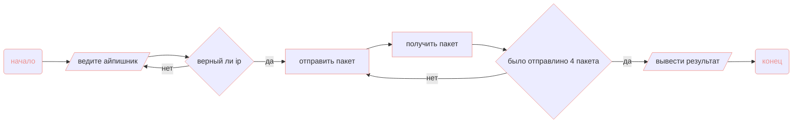
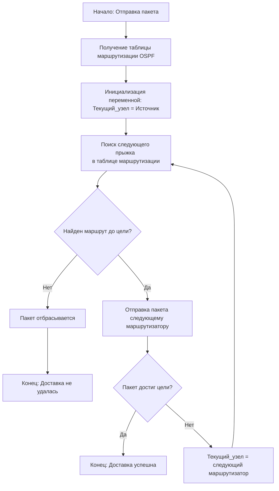
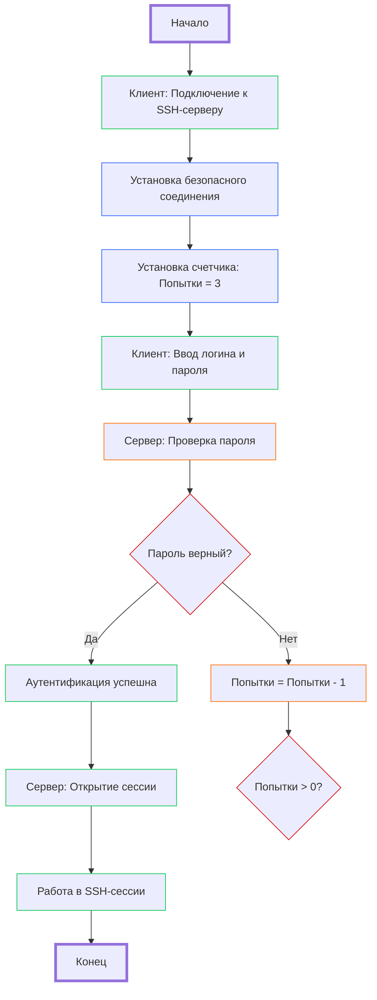
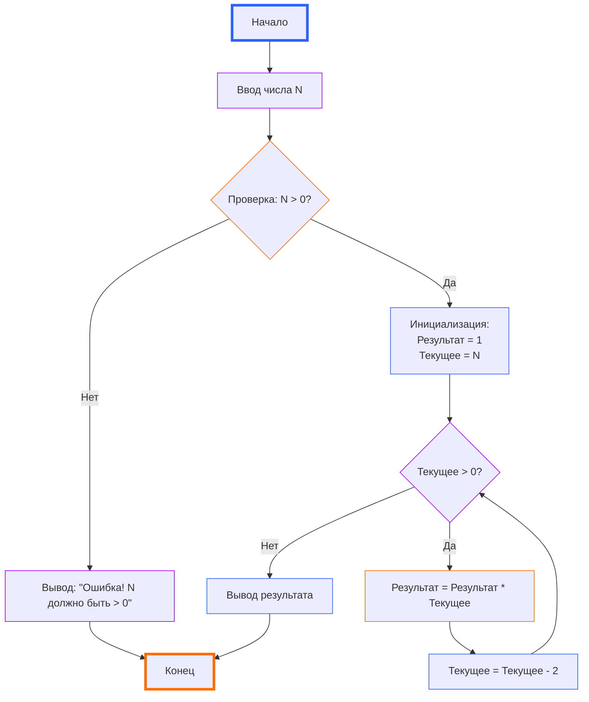

*ЗАДАНИЕ 1*
flowchart LR

```mermaid
flowchart LR


    a("начало") --> b[/"ведите айпишник"/]

    b --> с{"верный ли ip"}

    с -- нет --> b

    с -- да --> d["отправить пакет"]

    d --> e["получить пакет"]

    e --> f{"было отправлино 4 пакета"}

    f -- нет --> d

    f -- да --> g[/"вывести результат"/]

    g --> h("конец")

  

    style a color:#E549,stroke:#E549

    style b stroke:#E549

    style с stroke:#E549

    style d stroke:#E549

    style e stroke:#E549

    style f stroke:#E549

    style g stroke:#E549

    style h stroke:#E549,color:#E549
```
```
```

*ЗАДАНИЕ 2*

```mermaid
---

config:

  theme: mc

---

flowchart TD

    A["Начало: Отправка пакета"] --> B["Получение таблицы маршрутизации OSPF"]

    B --> C["Инициализация переменной: <br>Текущий_узел = Источник"]

    C --> D["Поиск следующего прыжка <br>в таблице маршрутизации"]

    D --> E{"Найден маршрут до цели?"}

    E -- Нет --> F["Пакет отбрасывается"]

    F --> G["Конец: Доставка не удалась"]

    E -- Да --> H["Отправка пакета <br>следующему маршрутизатору"]

    H --> I{"Пакет достиг цели?"}

    I -- Да --> J["Конец: Доставка успешна"]

    I -- Нет --> K["Текущий_узел = следующий маршрутизатор"]

    K --> D
    ```mermaid
```


*ЗАДАНИЕ 3*


```mermaid
flowchart TD

    A["Начало"] --> B["Клиент: Подключение к SSH-серверу"]

    B --> C["Установка безопасного соединения"]

    C --> D["Установка счетчика: Попытки = 3"]

    D --> E["Клиент: Ввод логина и пароля"]

    E --> F["Сервер: Проверка пароля"]

    F --> G{"Пароль верный?"}

    G -- Да --> H["Аутентификация успешна"]

    H --> I["Сервер: Открытие сессии"]

    I --> J["Работа в SSH-сессии"]

    J --> K["Конец"]

    G -- Нет --> L["Попытки = Попытки - 1"]

    L --> M{"Попытки > 0?"}

  

    style A stroke-width:4px,stroke-dasharray: 0

    style B stroke:#00C853

    style C stroke:#2962FF

    style D stroke:#2962FF

    style E stroke:#00C853

    style F stroke:#FF6D00

    style G stroke:#D50000

    style H stroke:#00C853

    style I stroke:#00C853

    style J stroke:#00C853

    style K stroke-width:4px,stroke-dasharray: 0

    style L stroke:#FF6D00

    style M stroke:#D50000
```mermaid
```

*ЗАДАНИЕ 4*


```mermaid
flowchart TD

    A["Начало"] --> B["Ввод числа N"]

    B --> C{"Проверка: N > 0?"}

    C -- Нет --> D["Вывод: &quot;Ошибка! N должно быть > 0&quot;"]

    D --> E["Конец"]

    C -- Да --> F["Инициализация: <br>Результат = 1 <br>Текущее = N"]

    F --> G{"Текущее > 0?"}

    G -- Нет --> H["Вывод результата"]

    H --> E

    G -- Да --> I["Результат = Результат * Текущее"]

    I --> J["Текущее = Текущее - 2"]

    J --> G

  

    style A stroke:#2962FF,stroke-width:4px,stroke-dasharray: 0

    style B stroke:#AA00FF

    style C stroke:#FF6D00

    style D stroke:#AA00FF

    style E stroke:#FF6D00,stroke-width:4px,stroke-dasharray: 0

    style F stroke:#2962FF

    style G stroke:#AA00FF

    style H stroke:#2962FF

    style I stroke:#FF6D00

    style J stroke:#2962FF
    
    ```mermaid
```
